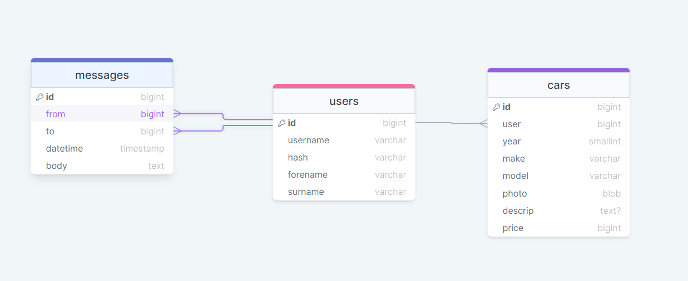

# Development of a Database-Driven Web Application for NCEA Level 3

Project Name: **MotiveAuto**

Project Author: **Myles Smalley**

Assessment Standards: **91902** and **91903**

-------------------------------------------------

## Design, Development and Testing Log

### 21/05/24

Starting Database Sketch

I began looking at what my final database would look like, and after a few different iterations, I landed on this. Each user can have many cars on the sight.

> User had no questions about the layout of the database, was happy with the layout, and all the features it offers.

I left the Database sketch how it was, since it would cater to the end-users needs as is.

### 23/05/24

Sketched out how I intend the website will run

Below is a all the actions I will aim to include in the functionality of my Website, including all the pages, their function, and all the options that the users will have when accessing the pages.

> Replace this text with any user feedback / comments

Replace this text with notes describing how you acted upon the user feedback: made changes to design, etc.

### 24/05/24

Started on Website Design using Figma

This is the first draft of what the front end of the home page of my website will look like. I will most definitely add to this, but I will get the end-user to give me tips on what to add.  

> End user wanted a search bar so they could search for cars that was, instead of jst scrolling in hope of finding the car they want. He also said that a darker colour scheme with highlights would be better than the black, white and grey.

Search bar was added, I shall look at colours later down the track.

### DATE HERE

Replace this test with what you are working on

Replace this text with brief notes describing what you worked on, any decisions you made, any changes to designs, etc. Add screenshots / links to other media to illustrate your notes where necessary.

> Replace this text with any user feedback / comments

Replace this text with notes describing how you acted upon the user feedback: made changes to design, etc.

### DATE HERE

Replace this test with what you are working on

Replace this text with brief notes describing what you worked on, any decisions you made, any changes to designs, etc. Add screenshots / links to other media to illustrate your notes where necessary.

> Replace this text with any user feedback / comments

Replace this text with notes describing how you acted upon the user feedback: made changes to design, etc.

### DATE HERE

Replace this test with what you are working on

Replace this text with brief notes describing what you worked on, any decisions you made, any changes to designs, etc. Add screenshots / links to other media to illustrate your notes where necessary.

> Replace this text with any user feedback / comments

Replace this text with notes describing how you acted upon the user feedback: made changes to design, etc.
