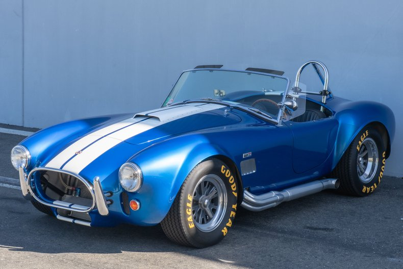

# Classic Car sharing Website

 

This is my level 3 NCEA Project for Digital Technologies.

It is a database-driven wb app that allows users to:

- Make an account
- Add a classic car that you own to the website for others to see
- Browse and view cars that people have added
- Make offers on cars by sending the owner a message
- Owners receiving, and viewing offers via an inbox. 

## Documentation

The following documents support this project:

- [Design & Review](Design.md)
- [Development & Testing](Development.md)

### Usernames for Moderation

- Username: moderator----Password: moderator

- Username: moderator2----Password: moderator2
