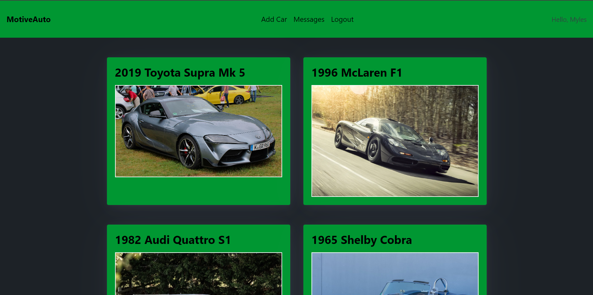
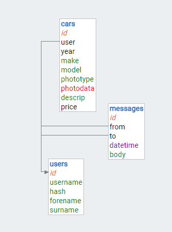
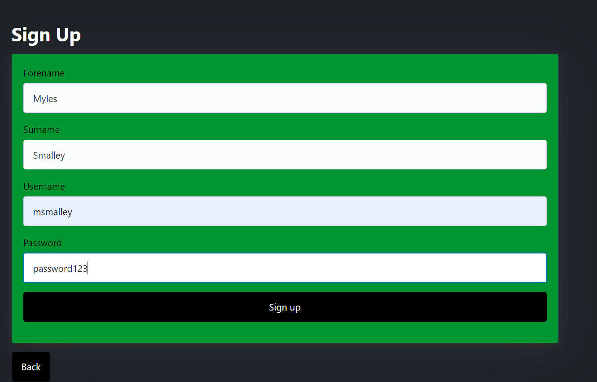

# The Design of a Database-Driven Web Application for NCEA Level 3

Project Name: **MotiveAuto**

Project Author: **Myles Smalley**

Assessment Standards: **91902** and **91903**

-------------------------------------------------

## System Requirements

### Identified Need or Problem

Investment Vehicles are slowly going on the decline, and finding them is becoming more and more difficult, so being able to have all things investment vehicles in one place, for buying or selling, will be ideal for the car investment community.

### End-User Requirements

**Car Investors** are people who buy old/classic cars knowing that over the period they have them, they can sell them for more money that they bought is for. These **investors** need to sell their cars they have, and after they have sold them will want to buy a new one. They will need to see a list of cars that are available to them, and be about to have a way to contact the buyer with an offer for a car they want.

### Proposed Solution

My proposed solution to this is a website, where investors can view all the cars available to them on a home page. They should be able to view a photo of the the car they want, and it be linked to a page with more information about the car, including a way to contact the owner with an offer. 

**Investors** should be able too:
- Make an account on the website.
- Be able to sign in and out of the website.
- Be able to list cars, with a photo and information about said car.
- When viewing the car, be able to send a message to the owner, asking questions, or making an offer.
- Each user will have an inbox where they can receive these questions and offers on their vehicles.

 

-------------------------------------------------

## Relevant Implications

### Functionality Implications

The functionality implications of a digital technology or digital outcome (e.g. a website) relate to how well it works for the end-user, in terms of meeting its intended purpose.

It is important to have a website that works, well and is easy to use, since a good number of my end users will be older people, who won't have much experience with tech.

To cater for those that are less experienced with tech using this website, I will make sure that navigation throughout my website will be easy. I will insure this by using:
- Have the design of the website simple and minimalistic
- Make Page transitions smooth

### Aesthetic Implications

The aesthetic implications of a digital technology or digital outcome (e.g. a website) relate to how it looks in terms of design.

Making a website look appealing one of, if not **the** most important things to consider when making a website. I plan to have my website very simplistic. With a light colour scheme, and simplistic font.

Some things I will need to consider relating to this heuristic are:
- Having a good colour scheme
- Getting a good font that works well with said colour scheme
- Having the content of the page laid out well

### End-User Implications

The end-user implications of a digital technology or digital outcome (e.g. a website) are connected to the specific needs of the end-user(s).

This implication is relevant because people of varying adult ages will be using this site, and having a UI that is easy to use and be usable for all the ages that might use it. Making sure the site appeals to that target audience is important as well. Using cool, more masculine type colours to make sure the sight isn't repulsive to the target audience.

Things I will need to consider moving forward is: 
- Making the UX very easy, and not complex.
- Use cool, masculine type colours
- Make sure the site is appealing

### Accessibility Implications

The accessibility implications of a digital technology or digital outcome (e.g. a website) involve ensuring it is available to, and can be used by, all end-users, regardless of their abilities.

Making sure this website is accessible for all uses is a must. To insure this, I will make sure that my website doesn't rely on heavily on red/green colours so those who are colour-blind won't be impaired while using my site.

Things I will need to consider moving forward for this implication is: 
- Accessible for the colour-blind
- Have good colours and fonts.

### Privacy Implications

The privacy implications of a digital technology or digital outcome (e.g. a website) relate to protecting the privacy of end-users and their data.

This website needs to have an account system, and be able to log in and out successfully. with thins we need to have some kind of password security to insure the safety of the end-users data. 

Things I will need to consider moving forward for this implication is: 
- Hashing users passwords for security purposes
- Making an account should be simple and easy

-------------------------------------------------

## Relevant User Experience (UX) Principles

### Match Between System and the Real World

Use words, images and concepts that are familiar to the user.
Reflect real-world experiences.

Make the UI similar to other browsing/shopping apps to insure familiarity.

Things I will need to consider moving forward for this implication is: 
- Using navigation that is at the top of the page
- Having an image to show the car

###  Consistency and Standards

Where possible, stick to conventions for UI elements and layout.
In general, place menus at the top or left-side, use standard icons for home, etc.

I'll make the navigation easy to see, read, and use icons that are familiar and are very self-explanatory.

I'll use things like:
- Text that is easy to read for navigation.
- Have all the navigation on the top of the screen, or in a dropdown menu.

### Aesthetic and Minimalist Design

Keep the UI a simple as possible, focussing on the current user action. Only show necessary information at any stage. Avoid overwhelming the user with useless information.

Making sure the UI is easy to use and simple is a necessity for this project, to make sure it is easy to use for those in a higher age group.

I'll do this by:
- Only showing important information on the screen
- Make sure that adding cars to the database is not complicated/extensive
- Make sure navigating is not overwhelming.

-------------------------------------------------

## Final System Design

### Database Structure

### User Interface Design

Final Homepage Design:

Final Colour Scheme:

-------------------------------------------------

## Completed System

### Database Structure

### User Interface Design

Here is a video of my testing the functionality of my website: 

https://mywaimeaschool-my.sharepoint.com/:v:/g/personal/msmalley_waimea_school_nz/EUZk9MIE97JPn_qntpVFKcsBPJwmSGgS7b_gXa1hDFmc2Q?e=ZvKiT0&nav=eyJyZWZlcnJhbEluZm8iOnsicmVmZXJyYWxBcHAiOiJTdHJlYW1XZWJBcHAiLCJyZWZlcnJhbFZpZXciOiJTaGFyZURpYWxvZy1MaW5rIiwicmVmZXJyYWxBcHBQbGF0Zm9ybSI6IldlYiIsInJlZmVycmFsTW9kZSI6InZpZXcifX0%3D

-------------------------------------------------

## Review and Evaluation

### Meeting the Needs of the Users

My interface meets the need of my end users very well. I stated that the end users need to sell their cars they have, and need to see a list of cars that are available to them, and be about to have a way to contact the buyer with an offer for a car they want. My inferface offers answers to both those needs and they work well, and the end users can access them with ease.

### Meeting the System Requirements

My interface meets the system requirements effectively. A list I made at the start of this process states that my interface needs to have:
- Make an account on the website.
- Be able to sign in and out of the website.
- Be able to list cars, with a photo and information about said car.
- When viewing the car, be able to send a message to the owner, asking questions, or making an offer.
- Each user will have an inbox where they can receive these questions and offers on their vehicles.

The end product caters to every single one of those requirements, with good funtionality. 

### Review of Funtionality

In my Funtionality needs, I stated I needed to:
- Have the design of the website simple and minimalistic
- Make Page transitions smooth

Looking at the home page of my website, I (and my end user) thinks that the interface is minimalistic and simple. It isn't in your face, and is very self explanatory.

The page transitions are very smooth, because of the use of HTMX Routing. Reloading the page is rarely seen in this interface, and most of the functionality happens on a single page. You will be able to see this in the funtionality video I linked earlier in the document.

Home page:

### Review of Aesthetic

For my Aesthetic needs, I stated I needed to:
- Having a good colour scheme
- Getting a good font that works well with said colour scheme
- Having the content of the page laid out well

The colour scheme I used on my interface is not hard on eyes at all, is very easy to look at and works well with the content on the page. The font in used is a very basic one nothing fancy and simplistic, so that it works well with the colour scheme. The contents of the page are well spaced, centered and don't affect the expereince. 

Final colour scheme

Home Page:

### Review of End-User

For my End-User needs, I stated I needed to:
- Making the UX very easy, and not complex.
- Use cool, masculine type colours
- Make sure the site is appealing

As you can see from the funtionality video, The UX flows very nicely, and doesn't look clunky at all. I ended up using cool, masculine colours for the interface and they have turned out good, and work very well to make the interface look appealing.

Final colour scheme

### Review of Accessibility

For my Accessibility needs, I stated I needed:
- Accessible for the colour-blind
- Have good colours and fonts.

Althought the main colour of my website is green, none of the website's funtionality is dependant on the colour, (for example, if you have selected something, it turns green and it's red if you haven't selected it) and therefore, the website's overall funtionality is not effected. as stated before, the colours and fonts in the interface work well together, and do not clash.

Final colour scheme

### Review of Privacy

For my Accessibility needs, I stated I needed:
- Hashing users passwords for security purposes
- Making an account should be simple and easy

The process of making an account in the interface is extreamly easy, and straightforward. When the account is make, it is stored in a secure database and the passwords are hashed for extra security. 

Creating a Login:

Details in Database and password Hashed:

### Review of Match Between System and the Real World

For my Match Between System and the Real World needs, I stated I needed to be:
- Using navigation that is at the top of the page
- Having an image to show the car

I incorperated both of these needs into the interface, by having the navigation bar at the top of the screen where it can easly be seen and used, and I am showing pictures of cars on the home page similar to other auto trading websites like AutoTrader and Trade Me to insure maximum familiarity.

Home page showing Navigation and Car Images:

### Review of Consistency and Standards

For my Consistency and Standards needs, I stated I needed to have:
- Text that is easy to read for navigation.
- Have all the navigation on the top of the screen, or in a dropdown menu.

As shown, you can see that the navigation is at the top of the screen, and the text is a good size, evenly spaced and therefore easy to read, and accessable. 

Home page showing Navigation and Text:

### Review of Aesthetic and Minimalist Design

For my Aesthetic and Minimalist Design, I stated I needed to be:
- Only showing important information on the screen
- Making sure that adding cars to the database is not complicated/extensive
- Making sure navigating is not overwhelming.

When coding my interface, I made sure to only have essential information in all the pages/screens to insure maximum accessablity for all ages, part of which was making the navigation not overwhelming. The process of adding a car to the database is very easy, and once again, only asks for what is absolutley necessary.

Home page:

Add Car Page:

